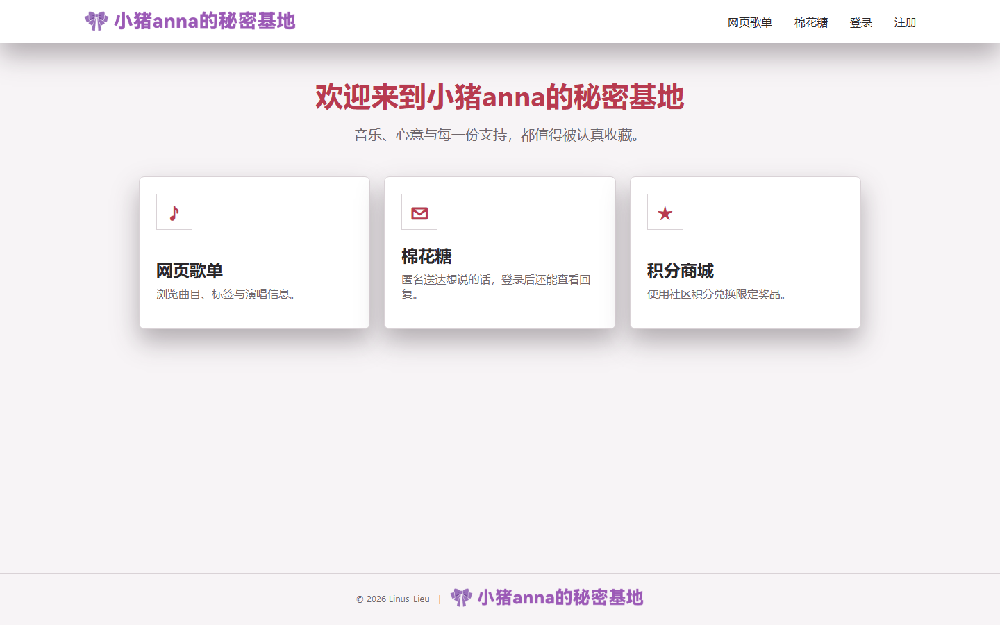
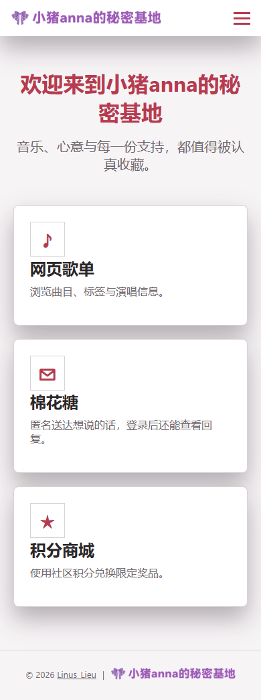

# Anna BLive Fan Hub

`anna-bliver-fan-hub` 是一个面向 B站直播社区的全栈展示项目。公开版保留歌单、棉花糖、积分账本和完整的积分商城，站点资料与主题均可由管理员配置。



<details>
<summary>移动端首页</summary>



</details>

## 核心功能

- 可搜索、带标签的网页歌单与批量导入管理
- 匿名棉花糖投递、用户认领、回复和已读管理
- 最多五个 B站 UID 绑定到同一积分钱包
- 礼物与 SC 事件幂等入库、按房间和起算时间折算积分
- 商品选项、购物车、收货地址、积分结账、个人订单
- 后台商品管理、订单处理、拒绝或取消时幂等退款与回库存
- 数据库配置优先的站点标题、文案、UID、Logo、备案和主题色
- 全站固定作者署名与“小猪anna的秘密基地”品牌 Footer

公开版不包含 Bot 管理、QQ/AI 配置、盲盒统计、礼物展示或截图、OBS、激活码、主播房间管理和电影票币种。

## 技术架构

```text
React 18 SPA
  | REST + JWT
Express API
  |-- MySQL 8: users, content, points ledger, shop orders
  |-- Bilibili QR API: server-only transient login session
  |-- Optional Bot WebSocket client: gift / super_chat events
  `-- Optional Aliyun Captcha and Tencent SES
```

前后端分为 `frontend/` 与 `backend/`。`backend/src/config/schema.sql` 是全新部署基线，不承担旧生产数据库迁移。

## 本地运行

要求 Node.js 20+、npm 和 MySQL 8。

```bash
mysql -u root -p < backend/src/config/schema.sql

cd backend
cp .env.example .env
npm install
npm start

cd ../frontend
cp .env.example .env
npm install
npm start
```

管理员账号不带默认密码。需要虚构演示数据时，显式提供至少 12 位密码：

```bash
cd backend
DEMO_ADMIN_PASSWORD='replace-with-a-local-password' npm run seed:demo
```

演示账号邮箱为保留域名 `demo-admin@example.invalid`，演示数据不对应真实用户、UID 或订单。

## 网站配置

管理员页面：`/admin/site-config`。

配置优先级固定为：

```text
settings 表 > 环境变量 > 通用默认值
```

可配置网站标题、创作者称呼、Logo、favicon、首页 B站 UID、欢迎语、三张功能卡、歌单和棉花糖文案、备案信息及主题色。Footer 的 `© 2026 Linus_Lieu` 与作者链接是代码级固定署名，不允许后台覆盖。

## 积分与商城事务

`bilibili_point_events.source_event_id` 唯一。礼物与 SC 先持久化，再由结算器按 `POINTS_ROOM_ID`、`POINTS_START_AT` 和 `POINTS_COIN_PER_POINT` 过滤与折算。`settled_at` 使迟到、乱序和启动补偿事件可重复扫描而不重复加分。

购物车操作不预扣积分。结账在同一 MySQL 事务内锁定钱包、商品和选项库存，然后扣积分、减库存、创建订单与兑换明细，最后清空已结算购物车。任一步失败都会回滚。订单拒绝或取消使用唯一退款流水，并以 `refunded_at` 防止重复退分和重复回库存。

## 可选 Bot WebSocket

未设置 `BOT_WS_URL` 时连接器完全关闭，网站、手工积分、CSV 导入和商城仍可独立运行。配置后，网站作为客户端接收：

```json
{
  "type": "gift",
  "event_id": "stable-source-id",
  "room_id": "<configured-room-id>",
  "uid": "<bilibili-uid>",
  "username": "Demo User",
  "total_coin": 1000,
  "timestamp": "2026-01-01T00:00:00+08:00"
}
```

`type` 也可为 `super_chat`。网站返回：

```json
{ "type": "event_ack", "event_id": "stable-source-id", "status": "accepted" }
```

`status` 为 `accepted`、`duplicate` 或 `rejected`。可通过 `BOT_WS_TOKEN` 使用 Bearer Token；连接器带指数退避和启动补偿请求。未来公开 Bot 时，只需稳定生成 `event_id` 并实现 ACK 重发队列。

## 扫码绑定安全

- `POST /api/bilibili-binding/qr` 创建绑定到当前网站用户的短时会话。
- `GET /api/bilibili-binding/qr/:key` 只能由会话创建者轮询。
- B站 Cookie 和 refresh token 只存在于单次后端调用内，不返回前端、不入库、不写日志。
- 同一 UID 不可绑定不同用户；每位用户最多五个 UID；主 UID 可切换。
- 绑定时匿名 UID 钱包在事务内合并到用户钱包，并保留完整流水。

## 测试

```bash
cd backend && npm test
cd frontend && npm run build
```

测试覆盖配置优先级、Footer 安全链接、扫码会话隔离、事件幂等和过滤、购物车不预扣、结账原子顺序、退款幂等、演示密码门槛及移除模块扫描。仓库截图由 Playwright 在 1440×900 和 390×844 视口生成。

## 安全与公开边界

- `.env.example` 仅含占位符，`.env`、数据库、上传文件和构建产物均被忽略。
- 邮件发件地址、站点域名和通知目标全部来自环境变量。
- 本仓库是无旧 Git 历史的公开展示版，不包含生产迁移或备份。
- 发布前建议再次运行密钥和个人信息扫描，并轮换任何曾经进入其他仓库历史的凭证。

## License

[MIT](LICENSE) © 2026 [Linus_Lieu](https://github.com/LinusLieu)
